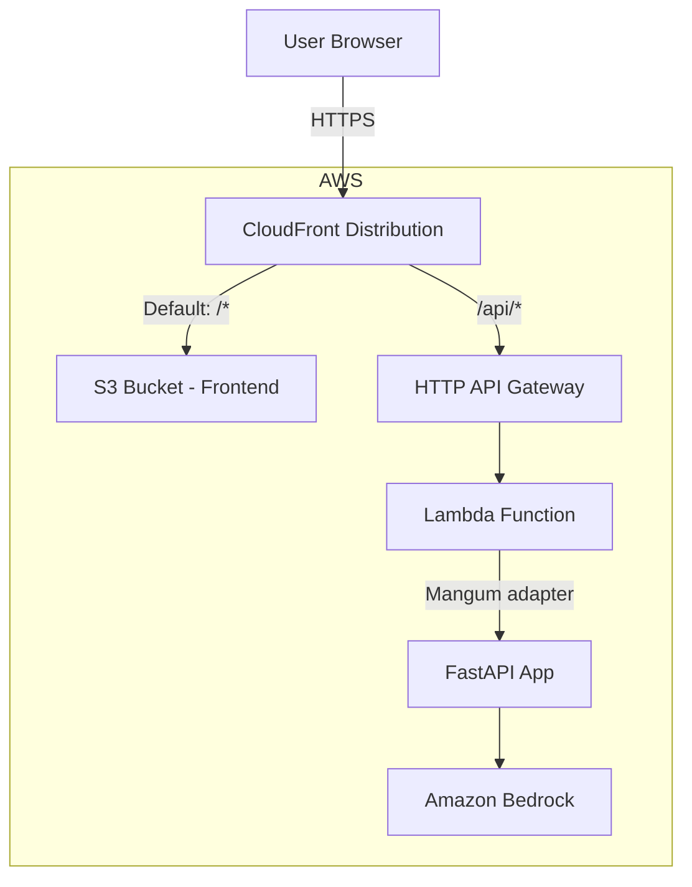

# Design Document: CDK Deployment

## Overview

This design defines a single-stack AWS CDK (TypeScript) deployment for the Semester Capacity Planner. The stack provisions:

- An S3 bucket for the React frontend static assets
- A CloudFront distribution as the single entry point
- A Python Lambda function running the FastAPI backend via Mangum
- An HTTP API Gateway connecting CloudFront to the Lambda

All infrastructure is defined in one CDK stack (`DeploymentStack`) inside an `infra/` directory at the project root.

## Architecture



### Request Flow

1. All traffic enters via the CloudFront distribution URL
2. Paths matching `/api/*` are forwarded to the HTTP API Gateway origin, which proxies to the Lambda function
3. All other paths are served from the S3 bucket (frontend static assets)
4. If an S3 object is not found (403/404), CloudFront returns `index.html` with status 200 for SPA client-side routing

## Components and Interfaces

### Directory Structure

```
infra/
├── bin/
│   └── app.ts              # CDK app entry point
├── lib/
│   └── deployment-stack.ts # Single stack with all resources
├── package.json
├── tsconfig.json
└── cdk.json

backend/
├── handler.py              # NEW: Mangum wrapper (Lambda entry point)
├── main.py                 # Existing FastAPI app
├── requirements.txt        # Existing dependencies (includes mangum)
└── ...

frontend/
├── dist/                   # Build output (vite build)
└── ...
```

### CDK App Entry Point (`infra/bin/app.ts`)

```typescript
import * as cdk from 'aws-cdk-lib';
import { DeploymentStack } from '../lib/deployment-stack';

const app = new cdk.App();
new DeploymentStack(app, 'SemesterPlannerStack');
```

### DeploymentStack (`infra/lib/deployment-stack.ts`)

The single stack defines these constructs:

| Construct | CDK Class | Purpose |
|-----------|-----------|---------|
| Frontend Bucket | `s3.Bucket` | Private bucket for React build output |
| Bucket Deployment | `s3deploy.BucketDeployment` | Uploads `frontend/dist/` to bucket |
| Backend Lambda | `lambda.Function` | Runs FastAPI via Mangum |
| HTTP API Gateway | `apigwv2.HttpApi` | Routes HTTP to Lambda |
| CloudFront Distribution | `cloudfront.Distribution` | CDN entry point with two origins |
| OAC | `cloudfront.S3OriginAccessControl` | Secure S3 access from CloudFront |

### Lambda Handler (`backend/handler.py`)

```python
from mangum import Mangum
from backend.main import app

handler = Mangum(app)
```

### CloudFront Behaviors

| Behavior | Path Pattern | Origin | Cache Policy | Allowed Methods |
|----------|-------------|--------|--------------|-----------------|
| Default | `*` | S3 (via OAC) | Default (caching enabled) | GET, HEAD |
| API | `/api/*` | HTTP API Gateway | CacheDisabled | All methods |

### SPA Fallback

CloudFront `errorResponses` configuration:
- 403 → `/index.html` (200)
- 404 → `/index.html` (200)

This ensures React Router handles client-side routing for any deep links.

## Data Models

No application data models are introduced by this deployment. The stack uses CDK constructs and CloudFormation resource models.

### CDK Stack Props

The stack uses default `StackProps` with no custom configuration. Environment (account/region) is inherited from the CDK CLI context.

### CloudFormation Outputs

| Output Key | Value | Purpose |
|------------|-------|---------|
| `DistributionUrl` | CloudFront distribution domain name | Access URL for the deployed application |

## Error Handling

| Scenario | Handling |
|----------|----------|
| S3 object not found (403/404) | CloudFront returns `index.html` with 200 status |
| Lambda cold start | Mangum handles ASGI lifecycle; 512MB+ memory minimizes cold start duration |
| Lambda timeout | 30-second timeout configured; API Gateway returns 504 on timeout |
| CDK synthesis failure | TypeScript compilation errors caught at build time |
| Deployment failure | CloudFormation rolls back automatically |
| Missing frontend build | `BucketDeployment` will fail if `frontend/dist/` doesn't exist; deploy script should build first |

## Testing Strategy

Since this feature is Infrastructure as Code (CDK/CloudFormation), property-based testing is **not appropriate**. IaC is declarative configuration — there are no pure functions with variable inputs to test universal properties against.

### Recommended Testing Approaches

1. **CDK Snapshot Tests** (primary)
   - Use `cdk synth` to generate the CloudFormation template
   - Assert specific resources exist with expected properties using CDK `assertions` library (`Template.fromStack()`)
   - Verify resource counts, property values, and relationships

2. **CDK Assertions (Fine-Grained)**
   - Verify Lambda has correct runtime, memory, timeout
   - Verify S3 bucket has public access blocked
   - Verify CloudFront has the correct behaviors and origins
   - Verify API Gateway has Lambda integration
   - Verify IAM policy grants `bedrock:InvokeModel`

3. **Deployment Smoke Test**
   - After `cdk deploy`, hit the CloudFront URL and verify 200 response
   - Hit `/api/health` (or similar) to verify Lambda is reachable
   - This is manual/CI-only, not automated in unit tests

### Test Framework

- Jest with `aws-cdk-lib/assertions` for CDK construct testing
- Tests live in `infra/test/deployment-stack.test.ts`
